*Prepared by Nabil-Fareed Alikhan. Last updated 2024-04-04*

Microreact provides charting feature, where you can show any data within your data file as a chart. In this recipe, we will plot serovar prediction, genotyping results and genome assembly metrics from a collection of *Salmonella* isolates. We will: 

* use the in-built bar chart options provided by Microreact first, 
* and then create a box and whisker plot using the custom chart feature. 

!!! tip
    Microreact is a flexible platform, you do not need to have a phylogenetic tree or geographic data to make use of it. 

The final output should like this, which shows multiple plots of number of isolates in this study grouped by country and serovar, and plots showing assembly metrics such as N50 and total assembled bases grouped by serovar. 

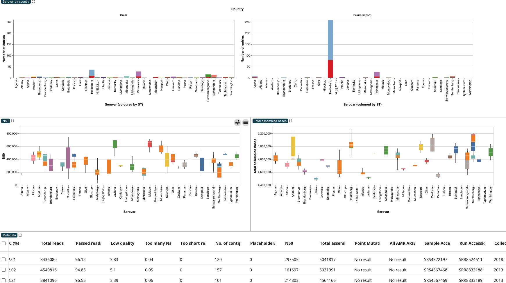

!!! tip 
    Please complete prequisite recipe about [uploading to Microreact](./basic-upload.md). 

## Microreact features demonstrated

* Adding new panels
* Creating a stacked bar plot 
* Using Vega for custom charts (box plot)
* Exporting images
* Renaming chart panels 


## About this dataset 

To illustrate these aspects of Microreact, we will use the dataset described in Alikhan et al. (2022)[^1]. This study look at non-typhoidal *Salmonella enterica*, often from contaminated poultry meat, causes diarrhoeal disease. This study examines 183 Brazilian chicken and 357 UK-imported poultry product genomes. In this dataset, *Salmonella* Heidelberg and Minnesota predominate in Brazil and imported meat.

For this exercise you will require the following files:

* [Link to metadata table](adding-charts/chart-example-file.tsv)

## Create a stacked bar chart with the built-in charting feature

A stacked bar chart is useful for its simplicity and clarity, facilitating easy comparison of categorical data. It offers flexibility in representing various data types and can be visually impactful, making it accessible to diverse audiences. Using the moudlar panels in Microreact, you can show a number of charts, alongside other panels showing maps, phylogenetic trees or networks. This section focuses specifically on making a bar chart, but other charts are possible in Microreact as we will see in the next section. 

### Tutorial

You should be able to upload the metadata table and have a new Microreact project. If you are unsure how to do that please complete prequisite recipe about [uploading to Microreact](./basic-upload.md). When you load in the data, the data table will appear as one panel filling the screen. 

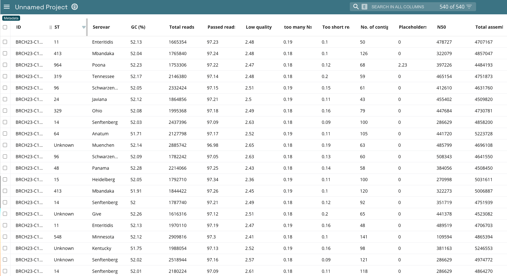

To add the chart, click the pencil icon in the top right, and select add chart from the drop down. 

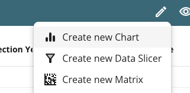

This will give you a box outline which allows you to choose the location of the panel. Click on the top half of the existing data panel view. The screen will now be split in half, with the top half showing a blank chart panel, and the bottom half showing the data table from before. This is shown below. 

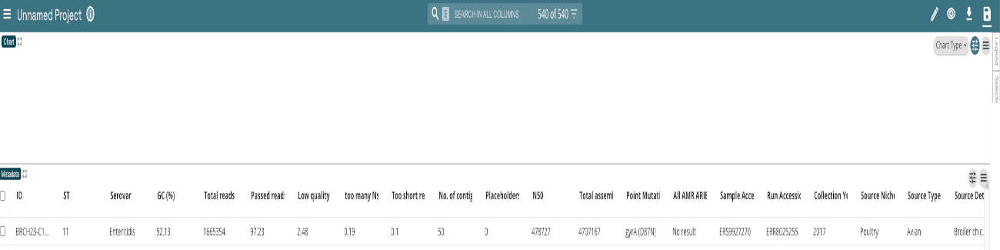

!!! tip
    There a mutiple menus in Microreact, There is a global settings menu in the top right of the screen (on the green bar), and each and every panel you create has its own settings menu in the top right of the panel. 
    There is more information about the chart settings [in the Microreact documentation](https://docs.microreact.org/instructions/adding-and-editing-panels/charts-panel)

All the settings for the chart are controlled by the settings *in the top right of the panel*. As shown in the example below, there are five main setting options:

* **Chart type**: controls the type of chart. The custom option allows you specify a custom graph using the Vega Lite specifications, which will be shown in the next section. 
* **X axis**: The horizontal.  
* **Y axis**: The vertical.
* **Colour**: defines the series to be coloured (which variables are charted against each other for comparison).
* **Facet**: While the Colour Column plots values separately for each Colour Column value, they all use the same primary axis. The Facet Column splits them into separate charts. Setting the number of columns and rows changes the display layout of the charts. Setting one row per facet makes a very similar chart to selecting the "Row view" colour options.

If you cannot see this, click the settings button (second from the right) to show these option. Clicking the settings button again will hide the menu. 

For this recipe: 

* Select "Bar chart" under Chart Type. 
* Under X axis, set the column as "Serovar"
* Leave Y axis as is, which is "Frequency (number of entries)"
* Under Colour, set the colour column as "ST"
* Under Facet, set the column to "Country"

!!! warning
    These column names refer to the column names in the data file (at the bottom). These names are case sensitive, so capitalisation is important. In this example, you need to set the X axis column as "Serovar", not "serovar" or "SEROVAR". Most aspects of Microreact are case sensitive.

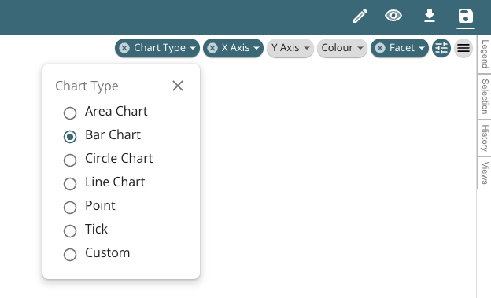

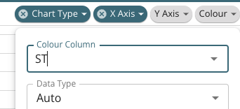

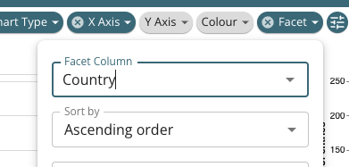

You will now see some charts in the chart panel. Note that the data has been split into multiple charts based on the country information, which is what the Facet option controls. To remove the facet setting, click the (X) button next to the word "Facet". There will be up to four, with the fourth going off the screen at the right, as shown below. You may see less depending on your screen size. Either way, we do not want this many charts. 
We only want to show two charts, where country is either "Brazil" or "Brazil (import)". We can filter the data in data table (at the bottom) and this will be reflected in the chart. 

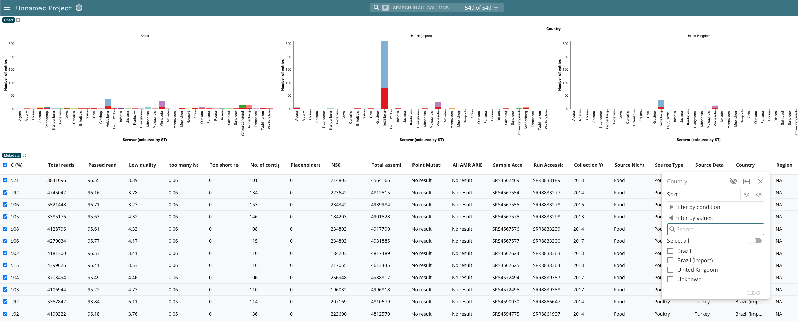

Navigate to the country column in the data table, you may need to scroll the data table to the right to find it. Then click the filter options, which is the graudated chevon button to the right of the column name "Country". The filter menu will allow you to pick the values to retain -- in this case select "Brazil" and "Brazil (import)". It should look like the image below. If you recall, this shows what was mentioned in the description of the dataset - that for this dataset *Salmonella* Heidelberg and Minnesota predominate in Brazil and imported meat.


The number of charts will change to two charts, one for "Brazil" and "Brazil (import)". The chart title will indicate which is which. 

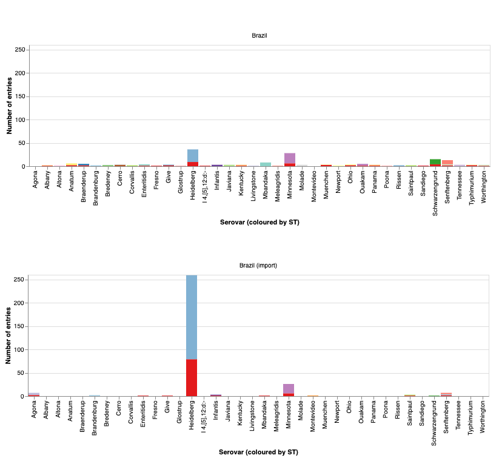

Remember, you can export these charts as .svg or .png so you can use them in any presentation, report or manuscript you are preparing. Just click the button in the top right (three lines/hamburger button) and select the format you prefer, either png or svg. 

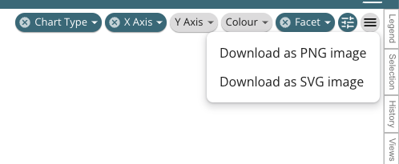


## Create a box and whisker plot with the custom charting feature

A box plot provides a concise summary of the distribution of a dataset, showing the median, quartiles, and outliers. It offers insights into central tendency, spread, and skewness, aiding in identifying variability and detecting potential anomalies or differences between groups, making it valuable in statistical analysis and data visualization. You can create one in Microreact, to show along side other visual elements. 

### Tutorial

You should use the existing project we created for the stacked bar plot above. First, create a new chart panel, and place it between the stacked bar chart we already made and the data table. From the panel menu, set the Chart type as "Custom", which will show an additional menu button called "Vega Spec", Click on "Vega Spec", which will open a small text box. You can resize the text box with the tag in the bottom right of the text box. Click and drag to resize. 

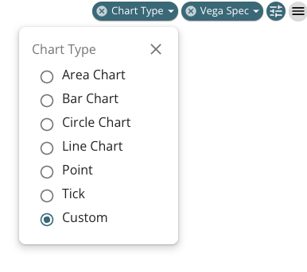

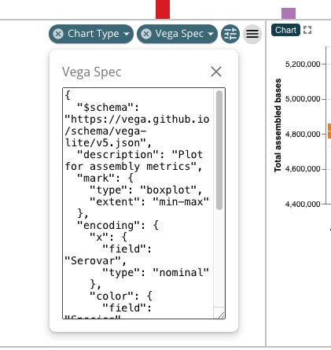

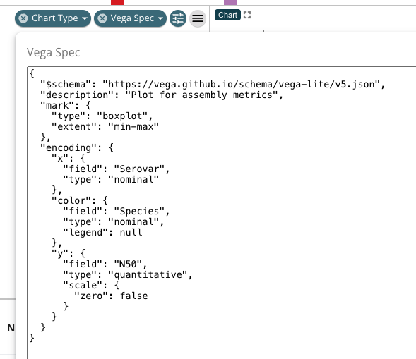

Inside this box we can paste a specification (Vega) of the chart. Here is one I prepared already that plots N50 as a box plot. Copy this and paste this in the Vega Spec box. By clicking away, the box will close and the chart should appear. 

``` json
{
  "$schema": "https://vega.github.io/schema/vega-lite/v5.json",
  "description": "Plot for assembly metrics",
  "mark": {
    "type": "boxplot",
    "extent": "min-max"
  },
  "encoding": {
    "x": {
      "field": "Serovar",
      "type": "nominal"
    },
    "color": {
      "field": "ST",
      "type": "nominal",
      "legend": null
    },
    "y": {
      "field": "N50",
      "type": "quantitative",
      "scale": {
        "zero": false
      }
    }
  }
}
```

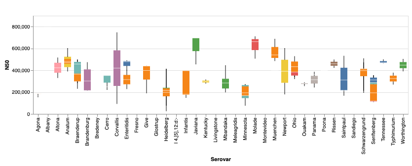


!!! note "What is Vega lite?"
    Vega-Lite is a high-level visualization grammar built on top of the Vega visualization grammar. It provides a concise JSON syntax for rapidly generating interactive visualizations for data exploration and presentation. Vega-Lite abstracts away low-level details, enabling users to create complex visualizations with minimal code. There are examples that you can adapt and use in microreact on [the Vega website](https://vega.github.io/vega-lite/examples/).

Try repeating this process again and create another plot along side the first one showing "Total assembled bases", just like the one below.  

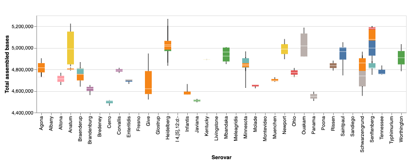

This means you need to do the following:

* Create a new chart panel
* Pin it next to the other panel showing N50
* Set the chart type as Custom 
* Paste the vega spec into the Vega Spec Text box, I have given the spec below. 


``` json
{
  "$schema": "https://vega.github.io/schema/vega-lite/v5.json",
  "description": "Plot for assembly metrics",
  "mark": {
    "type": "boxplot",
    "extent": "min-max"
  },
  "encoding": {
    "x": {
      "field": "Serovar",
      "type": "nominal"
    },
    "color": {
      "field": "ST",
      "type": "nominal",
      "legend": null
    },
    "y": {
      "field": "Total assembled bases",
      "type": "quantitative",
      "scale": {
        "zero": false
      }
    }
  }
}
```

Let's look at the spec, it has nested information explaining what to plot. There is a familiar section for x and y axes, and you can see that the field corresponds to the field in the data table. Remember this is case sensitive. There are more details on how to customise plots on [the Vega website](https://vega.github.io/vega-lite/examples/).

After all these steps you should have a view like the one below.


As a bonus, you might notice that the chart labels (top left of each panel) have a specific description. You can do this yourself by double clicking the chart label (by default this says "Chart") and entering in what ever label you like. So you can convert 

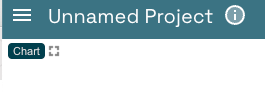


To 

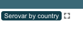


[^1]: Alikhan NF, Moreno LZ, Castellanos LR, Chattaway MA, McLauchlin J, et al. (2022) Dynamics of Salmonella enterica and antimicrobial resistance in the Brazilian poultry industry and global impacts on public health. PLOS Genetics 18(6): e1010174. https://doi.org/10.1371/journal.pgen.1010174

