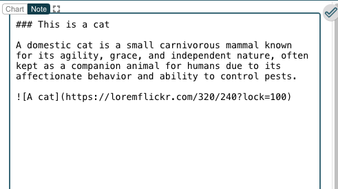
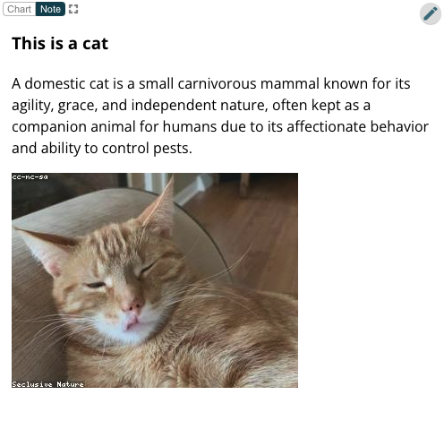

*Prepared by Nabil-Fareed Alikhan. Last updated 2024-04-04*

Most of Microreact's visualisation relies on the provided data table, but you may want to add addtional content for context. This may include extra text and figures. By using the Notes Panel, you can add such content. 

## Microreact features demonstrated

* Showing an additional text and an external image
* Markdown

## Showing an external image

In any Microreact project, create a new "Notes" panel, and pin it to a suitable location. Click the pencil in the top right of the panel.
Paste the following into the Notes box. 

```
### This is a cat 

A domestic cat is a small carnivorous mammal known for its agility, grace, 
and independent nature, often kept as a companion animal for humans due to 
its affectionate behavior and ability to control pests.


```




When you click the Tick in the top right, the Notes panel will render and look like the following. 



!!! note "What is Markdown?"

    The notes panel accepts a markup language called Markdown, and this is how it can process the link to the image. Markdown is a lightweight markup language that uses plain text formatting syntax to stylize documents. It's commonly used for formatting text on the web, such as creating headings, lists, links, and emphasizing text, without needing complex HTML coding. Markdown is easy to read and write and can be converted into HTML or other formats for web content creation. For more information of what can be shown via markdown please read [documentation](https://docs.microreact.org/instructions/adding-and-editing-panels/note-panel)


