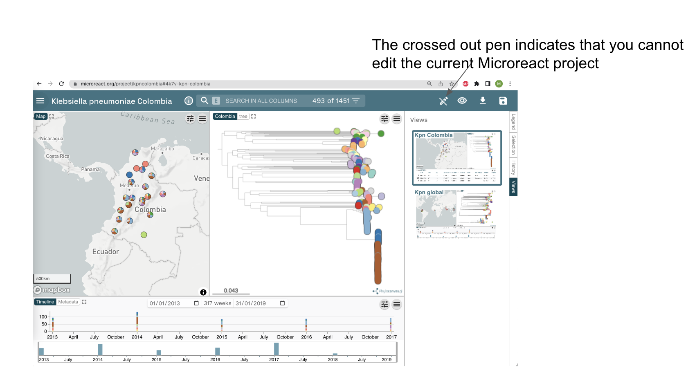
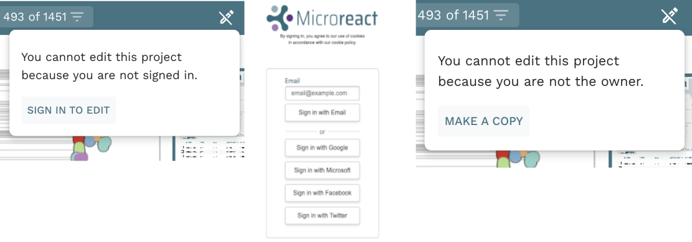
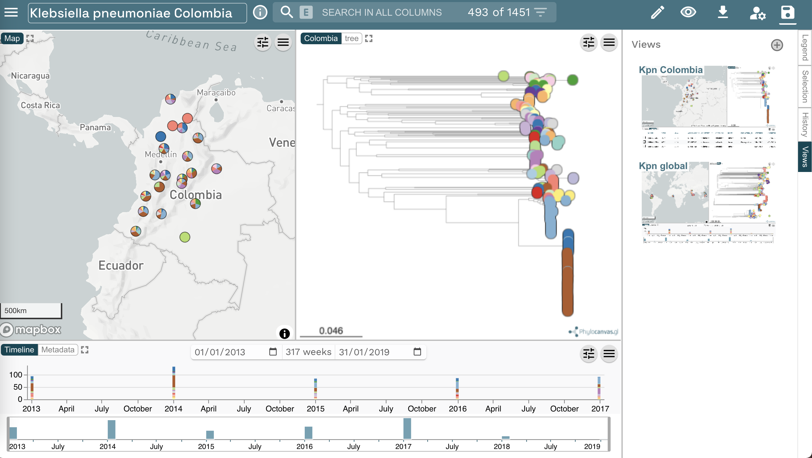

The dataset used through these recipes is already available on Microreact. Go to [microreact.org/project/kpncolombia](http://microreact.org/project/kpncolombia) and explore the collection of isolates. 

Public Microreact projects created by others, such as this one, are read only and cannot be edited by you. For our purposes, we need to make a copy of the project before proceeding. Notice the crossed out pen on right top corner of your screen. This indicates that you cannot edit the current Microreact project. 

{width="100%"}

We will make our own copy in the following steps. Click the crossed out "Pen" symbol in the top right of the screen. A window may appear asking you to "SIGN IN TO EDIT". You can sign in using another account, such as google, or you can use your email. When you use your email, a magic link will be sent to your email that will allow you to log-in.

Once you sign in, the message changes, and you are invited to "MAKE A COPY" of the current project. Make a copy, to proceed. Notice that, once you made a copy of the project, the crossed out "pen" symbol will change to a "normal pen", and you will be able to edit and save the project.

{width="80%"}

Now with your own copy of the project you can make any changes you like, without affecting the original. You are now ready to start manipulating the project as described in the next steps: 

1. [Present whole genome sequencing quality control (WGS QC) statistics in a chart.](./step-2.md)
1. [Explore what are the dominating sequence types (STs) in Colombia.](./step-3.md)
1. [Plot metadata blocks for the carbapenamase genes CTX-M-15, NDM-1, KPC and OXA to answer what are the prevalent AMR mechanisms detected.](./step-4.md)
1. [Explore which STs are associated with the presence of carbapenamase genes.](./step-5.md)
