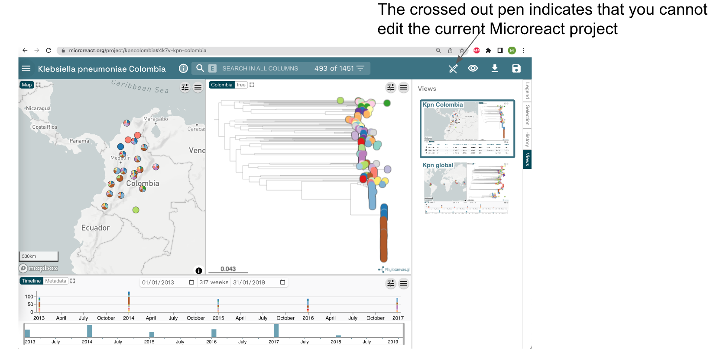

Notice the crossed out pen on right top corner of your screen. This indicates that you cannot edit the current Microreact project.

{width="100%"}

Click the crossed out "Pen" symbol in the top right of the screen. A window appears asking you to "SIGN IN TO EDIT".

{width="30%"}

Once you sign in, the message changes, and you are invited to "MAKE A COPY" of the current project. Make a copy, to proceed.

{width="30%"}

Notice that, once you made a copy of the project, the crossed out "pen" symbol will change to a "normal pen", and you will be able to edit and save the project.

{width="80%"}