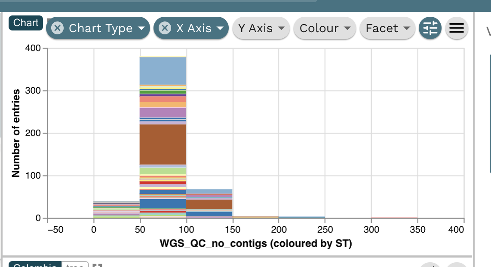

In this recipe, we will add a chart for some additional information about the genome assemblies, the number of assembled contigs, to show along side the map and tree. It should look like this:

This is a very useful way to display additional information, beyond the tree and map panels. The plots are integrated with other panels, so clicking on data in the bar plot will highlight these data in the other panels. The charting feature is generic and will plot any data in your provided data table. 

## Microreact features demonstrated

* Creating a new panel 
* Creating a standard stacked bar plot 

## Tutorial

You should be using the project we opened in the previous step. Please see [Creating an editable project](./step-1.md) and follow the instructions if not. Select the "Kpn Colombia" view. Click on the "Pen" symbol on the top right menu. Click on the "Create New Chart".

{width="60%"}

Drag the new chart to overlap with the tree. An empty panel for the new chart will be shown on top of the tree panel.

{width="90%"}

In the Chart Type dropdown list select "Bar Chart".

{width="80%"}

A new window appears. In the X Axis Column, select "WGS_QC_no_contigs" and for "Maximum number of bins" select 10

{width="80%"}

The bar chart will look like above. Observe that most genomes have less the 100 contigs. The colour in this case is coloured by the sequence type (ST). You can change this using the Colour dropdown. You can export the chart as a seperate image (svg or png) by using the hamburger menu button in the top right. 

{width="80%"}