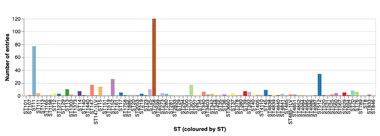
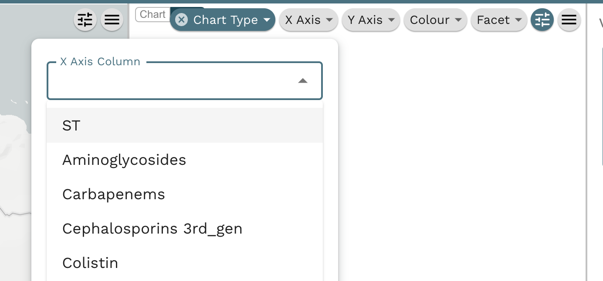

In this recipe we will revisit aspects of the previous recipes in this section and try to interpret the data. In particular, we will chart and review the collected information regarding the isolates' sequence type. The final output will be this chart below. 

!!! info "What is a sequence type (ST)?"
    The **sequence type (ST)** refers to a unique combination of alleles at the sequenced loci. Each unique ST represents a distinct strain or clone within the bacterial species under study. MLST data can be used for various purposes, including epidemiological studies, tracking the spread of infectious diseases, and understanding bacterial population dynamics. Sequence types are defined by MLST, which stands for Multi-Locus Sequence Typing. It is a molecular typing method used to characterize the genetic diversity of bacterial strains within a species. In MLST, several housekeeping genes are sequenced from each bacterial isolate. These genes are generally conserved across strains but can accumulate mutations over time. By comparing the sequences of these genes, we can determine the genetic relatedness between different isolates.

## Microreact features demonstrated

* Creating a new chart
* Customising a chart
* Updating an existing view
* Saving changes to a Microreact project

## Tutorial

You should be using the project we opened in the previous steps. Please see [Creating an editable project](./step-1.md) and follow the instructions if not. Now that you've created one chart, you can create another one! Click on the Pen symbol on the right hand side and click on "Create New Chart".

{width="60%"}

The new chart can stay right on top of the previously created one. Notice a white canvas on top of the previously generated chart.

{width="80%"}

{width="80%"}

Once again, from the Chart Type dropdown menu, select "Bar Chart", and when the new view shows up on the "X Axis Column", select ST.

{width="80%"}

A new chart will appear. The labels on the x-axis appear squished and they are hard to read. Drag the panel divider on the left hand side of the chart, to increase the width of the panel.

{width="80%"}

The information on the x-axis should be readable now. The 3 most abundant STs are ST11, ST258 and ST512.

{width="80%"}

Click the "Views" panel on the left hand side, hover over "Kpn Colombia", click on the three dots on the corner of the view and hit "Update View". And finally go to the Save icon on the right corner, press the icon and choose "Update This Project.

{width="40%"}

{width="60%"}