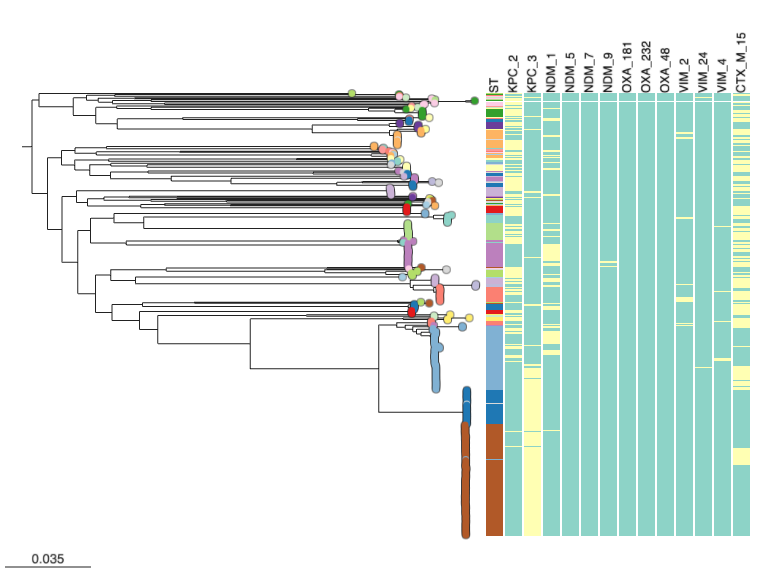

We have already [created charts to visualise data](./step-3.md) in our Microreact projects. Another useful feature of Microreact is to overlay information as 'Metadata blocks' alongside phylogenetic trees. This is the easiest way to do direct comparison with the evolutionary relationships (phylogeny) with other information. In this recipe, we will show the presence carbapenamase genes alongside the provided phylogenetic tree, just like the figure below. 

## Microreact features demonstrated

* Showing metadata along side a phylogeny
* Customising metadata blocks

## Tutorial

You should be using the project we opened in the previous steps. Please see [Creating an editable project](./step-1.md) and follow the instructions if not. Select the "Kpn Colombia" view. Press the icon on the top right of the tree panel.

{width="70%"}

In the Metadata blocks dropdown list, tick all boxes containing KPC, NDM, VIM, OXA and CTX-M-15 genes. In this same menu, you can also customise the block feature scaling with options like 'Block headers' and 'Block Size'. You can export the chart as a seperate image (svg or png) by using the hamburger menu button in the top right. 

{width="70%"}

The tree panel will show metadata columns aligned with the tree tips. Yellow indicates presence of a certain gene and green indicates absence. If you need to refer to the legend click the Legend tab on the right, and scroll down. In the panel shown here, it appears that the most common genes present (in yellow) are KPC-2, KPC-3, NDM-1 and CTX-M-15. 

