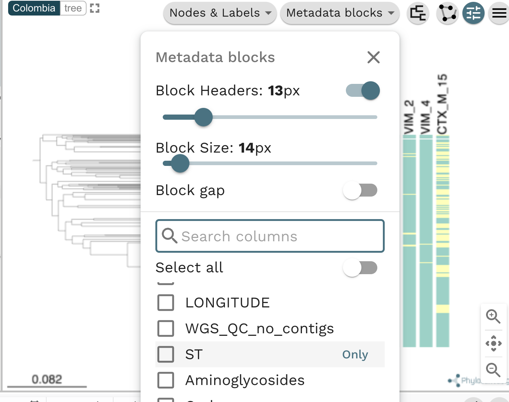
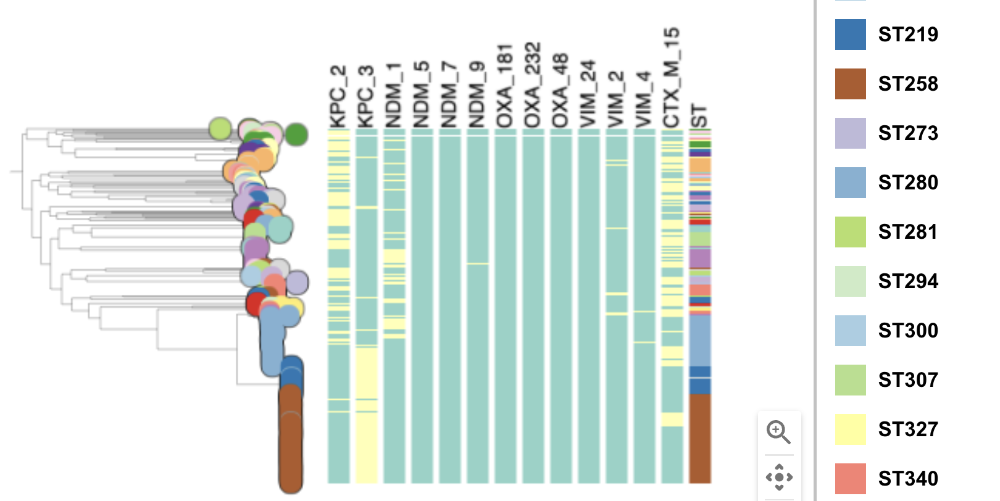

Go to the "Metadata blocks" and check the ST box.

{width="50%"}

Observe the new metadata column next to the tree, with the header "ST".

{width="50%"}

In the tree with added metadata blocks, we can observe a large brown block of isolates belonging to ST258. You will need to check the Legend on the very right of Microreact.

{width="50%"}

On a close look, we can observe that ST258 is associated with the presence of the carbapenamase gene KPC-3.

{width="80%"}
