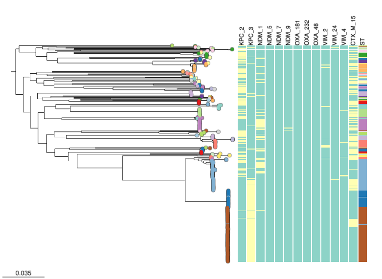

In this final recipe for this section we will revisit aspects of the previous recipes in this section and try to interpret the data. In particular, we will compare the phylogent, the isolates' sequence type, and presence of carbapenamase genes. The final output will be this chart below. 

## Microreact features demonstrated

* Showing metadata along side a phylogeny
* Customising metadata blocks

## Tutorial

You should be using the project we opened in the previous steps. Please see [Creating an editable project](./step-1.md) and follow the instructions if not. Select the "Kpn Colombia" view. Press the icon on the top right of the tree panel. Go to the "Metadata blocks" and check the ST box.

{width="50%"}

Observe the new metadata column next to the tree, with the header "ST".

{width="50%"}

In the tree with added metadata blocks, we can observe a large brown block of isolates belonging to ST258. You will need to check the Legend on the very right of Microreact.

{width="50%"}

On a close look, we can observe that ST258 is associated with the presence of the carbapenamase gene KPC-3.

{width="80%"}

Congratulations! you have completed this advanced tutorial in Microreact. You can continue by browsing the various recipes listed on the right, and trying to recreate them yourself with the example data provided. These will hopefully provide inspiration for possible visualisations you can create with your own data.