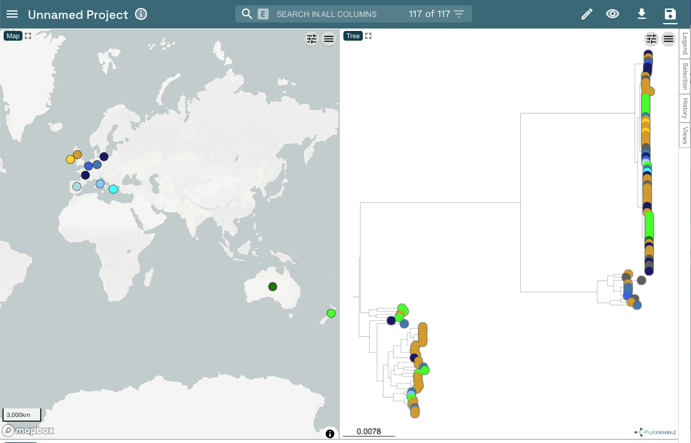
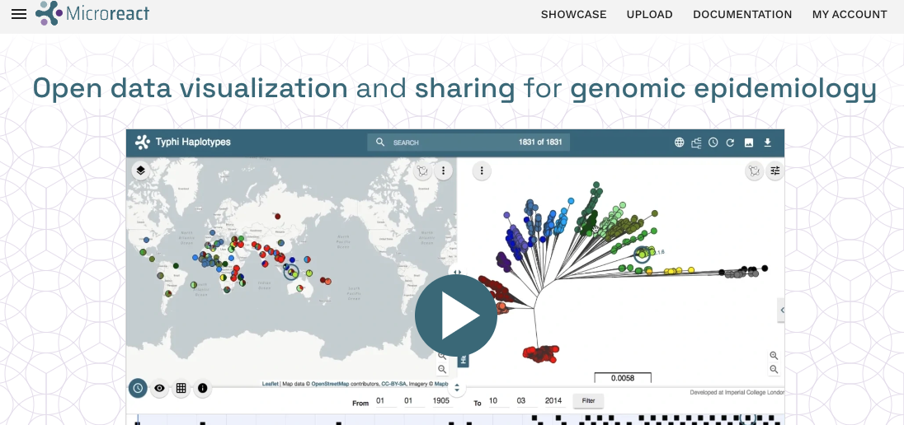
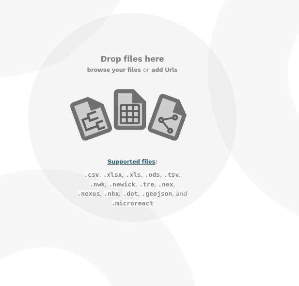
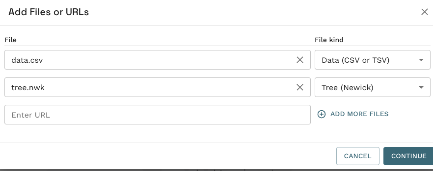
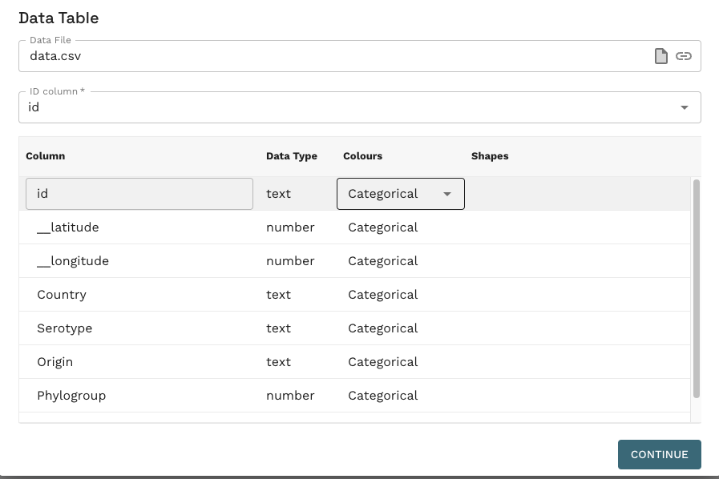
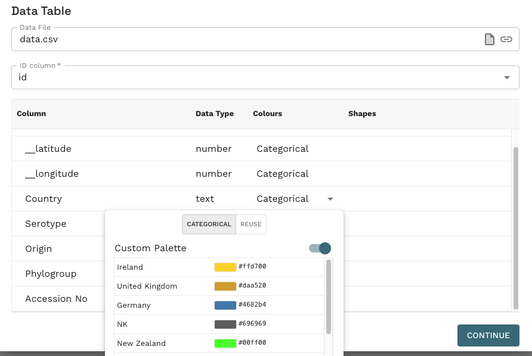
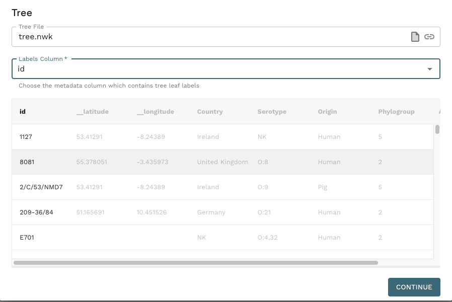
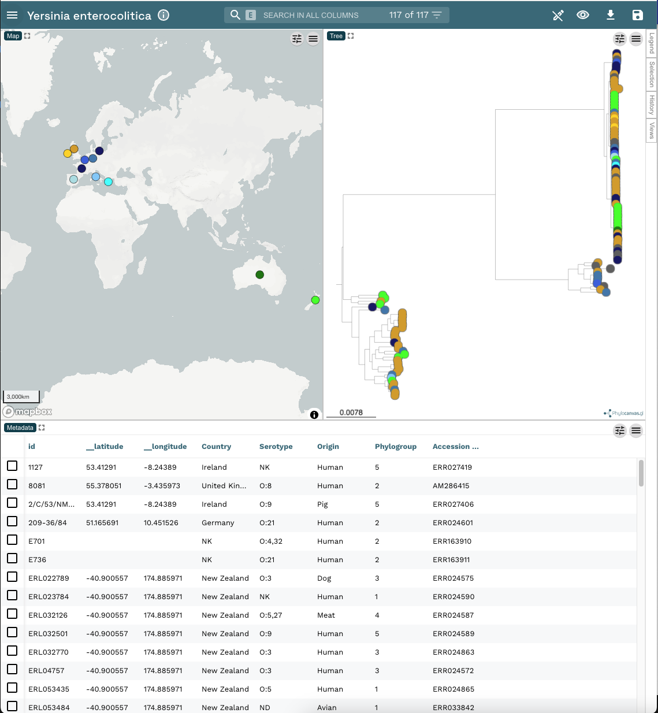

This recipe will walk you through the basic usage of Microreact, uploading a tree and metadata file for visualisation. 

!!! warning 
    When using your own data, do not upload sensitive or personally identifiable information to [microreact.org](microreact.org).

## Microreact features demonstrated

* Uploading metadata and a tree to microreact
* Choosing column for mapping tree tip labels to the metadata file
* Choosing colours for metadata columns

## About this dataset 

To illustrate these aspects of Microreact, we will use the dataset described in Reueter et al. (2015)[^1]. This study look at *Yersinia enterocolitica*, a leading cause of food-related gastroenteritis, which is classified into six phylogroups. They provide detailed analyses of the evolutionary processes leading to the emergence of these phylogroups. In particular, genomes belonging to PG3-5 (which is predominant in human infections) exhibit minimal sequence diversity but display significant functional variation, including pathogenicity and metabolism genes. Analysis of the core and accessory genome also suggested that the different *Y. enterocolitica* phylogroups may be ecologically separated, in contrast to the long-held belief of common shared ecological niches across the *Y. enterocolitica* species.

For this exercise you will require the following files:

* [Link to the metadata table](https://microreact.org/api/files/raw?045709f5a6b0f61c113409fb457c766d25363129)
* [Link to the phylogenetic tree](https://microreact.org/api/files/raw?7514d1e7f3fc13cab7ea312bc63496ea16349e24)

Be sure to have these downloaded onto your local computer. 

## Uploading files to Microreact

This is the fundermental first step, you must provide data for Microreact to show. 

First navigate to [microreact.org]([microreact.org) in your web browser. Click the Upload button in the top right. 

The upload button will show an interface as below, you can either drag and drop the download metadata table and phylogenetic tree file you download just prior, or click the Plus button in the bottom right or the center icons to open up a file upload dialog box.

!!! tip
    There are many more file types you can include in Microreact, these are explained [here in the official documentation](https://docs.microreact.org/instructions/creating-a-microreact-project/supported-file-formats). 

The Add files dialog will open, displaying the details of the files you just uploaded. This is an oppotunity to check the all the files are uploaded and for you to alter the type of file (under file kind). You can also add additional files if you like. 

If your window looks like the one below, this is fine. Click continue. 

Whenever you upload a data table, as we have in this case, you will get an additional window to select the colour settings for the different metadata fields. 

In our example, we are happy with the defaults so click Continue.

Feel free to repeat this exercise and alter the colour palette as you wish. These decisions are not final. You will have the oppotunity to alter the colour choices later as well.

Finally, you will be asked to choose and confirm the column that contains the information to map the different files together, in this case, we want to map the metadata in the data file to the tip labels in the tree file. These are basically the strain names in the id column. 

If your window looks like the one below, click Continue.

You will now see the Microreact project open with the map, tree and metadata panels open. 

Congratulations! you have succesfully uploaded and displayed some example data in Microreact. Now the real journey begins with customising the display and exploring your data! 

Feel free to try out another recipe from the menu on the left. 

[^1]: Reuter S, Corander J, de Been M, Harris S, Cheng L, Hall M, Thomson NR, McNally A. Directional gene flow and ecological separation in Yersinia enterocolitica. Microb Genom. 2015 Sep 29;1(3):e000030. doi: 10.1099/mgen.0.000030. 