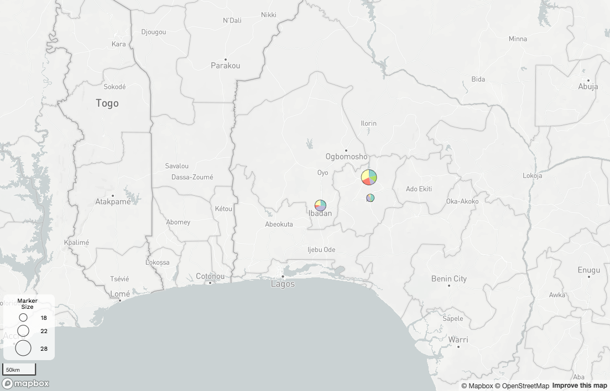
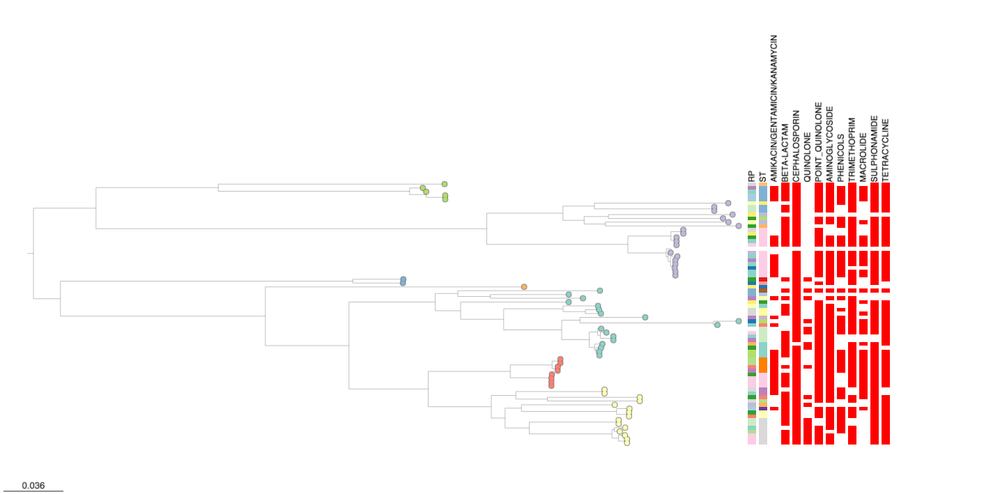

Microreact can be used to explore complex relationships between geography, phylogeny and other contextual information. In this example we will look at at an existing published dataset.

The microreact project is available [via this link](https://microreact.org/project/hmj3KwxS1dmmFPCKFx6qeA-invasive-escherichia-coli-sw-nigeria-2016-2018)

## Microreact features demonstrated

* Comparing evolutionary relationships (phylogeny) with spatial information.
* Overlaying additional genetic data (AMR prediction & genotyping) with evolutionary relationships 

## About this dataset 

This example shows data presented in Afolayan et al. "An ST131 clade and a phylogroup A clade bearing an O101-like O-antigen cluster predominate among bloodstream Escherichia coli isolates from South-West Nigeria hospitals Open Access", published in 2022 in *Microbial Genomics*. [https://doi.org/10.1099/mgen.0.000863](https://doi.org/10.1099/mgen.0.000863)[^1]

The study focuses on Escherichia coli bloodstream infections in Nigeria, highlighting their severity and the importance of managing them effectively. It notes the lack of comprehensive data in Nigeria regarding prevalent E. coli lineages, disease-causing attributes, and suitable drugs for treatment. The research conducted antimicrobial susceptibility testing on 68 bloodstream E. coli isolates from three Nigerian hospitals and utilized whole-genome sequencing (WGS) to analyze and characterize these strains.

The findings revealed the presence of globally disseminated, high-risk E. coli lineages among the isolates, notably sequence type 131, which is prevalent worldwide. Additionally, lesser-known genetically related strains carrying surface features likely acquired from Klebsiella bacteria were identified, necessitating further investigation. The study also uncovered a previously undetected outbreak caused by a less abundant E. coli lineage through retrospective analysis of the sequence data.

Moreover, the study identified various antimicrobial resistance genes within these E. coli lineages, including those conferring resistance to critical drugs like extended-spectrum cephalosporins used for managing infections in Nigeria. Overall, the research underscores the value of WGS in identifying significant E. coli lineages and potential outbreaks, highlighting its utility in enhancing understanding and management of E. coli infections in Nigeria.

* [Link to metadata table](https://microreact.org/api/files/raw?24b84257a3f709b645d02901978ea98198900fe5)
* [Link to phylogenetic tree](https://microreact.org/api/files/raw?d73e379972dfb70ef31b371e1ef619d034d5d2dd)

## Images from Microreact





``` bash 
cat * 
```

``` py
import tensorflow as tf
```

[^1]: Afolayan AO, Aboderin AO, Oaikhena AO, Odih EE, Ogunleye VO, Adeyemo AT, Adeyemo AT, Bejide OS, Underwood A, Argimón S, Abrudan M, Egwuenu A, Ihekweazu C, Aanensen DM, Okeke IN. An ST131 clade and a phylogroup A clade bearing an O101-like O-antigen cluster predominate among bloodstream Escherichia coli isolates from South-West Nigeria hospitals. Microb Genom. 2022 Dec;8(12):mgen000863. doi: [10.1099/mgen.0.000863](https://doi.org/10.1099/mgen.0.000863). PMID: 36748556; PMCID: PMC9837563.