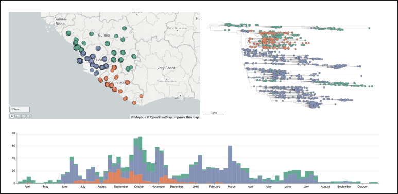

# Welcome to The Microreact Cookbook

This 'cookbook' has a collection of examples or 'recipes' to show you how to make the most of [Microreact](https://microreact.org/). [Microreact](https://microreact.org/) is a free and online visualisation tool, primarily for genomic data but it can be used for a variety of data visualisation use cases. The typical use case is to create stunning interactive data visualisations as this example shown below. 

Here are figures from a Microreact project based on data from Dudas et al. (2017)[^1]. You can view the interactive dashboard at [https://microreact.org/project/west-african-ebola-epidemic](https://microreact.org/project/west-african-ebola-epidemic)

* All examples here use the publicly available version of Microreact at [microreact.org](https://microreact.org/)
* For detailed description of specific features in Microreact, [please read the manual](https://docs.microreact.org/)
* If you have feedback and questions about microreact, please see the [contact instructions here](https://docs.microreact.org/feedback/contact)

!!! tip 
    Microreact can be installed behind your firewall to enable you to visualise sensitive data safely.
    To request a quote for the supported, Docker-packaged instance, please email microreact(at)cgps.group.

[^1]: Dudas G et al. Virus genomes reveal factors that spread and sustained the Ebola epidemic. *Nature*. 2017 Apr 20;544(7650):309-315. doi: [10.1038/nature22040](http://dx.doi.org/10.1038/nature22040)

## How to use this cookbook

The best way to use this cookbook is to browse the various recipes listed on the right, and try to recreate them yourself with the example data provided. These will hopefully provide inspiration for possible visualisations you can create with your own data.