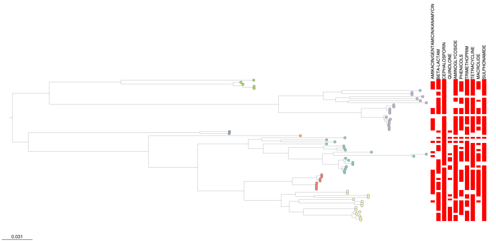

Microreact can be used to compare a phylogeny with other contextual information. In this example we will look at at an existing published dataset and customise the information shown along side the tree. We are aiming to produce a figure like the one below, which shows the drug resistance (red) along side the genetic relationship for a group of seqeunced isolates.

!!! tip 
    Please complete prequisite recipe about [uploading to Microreact](./basic-upload.md). 

## Microreact features demonstrated

* Overlaying additional genetic data (AMR prediction & genotyping) with evolutionary relationships 
* Basic customisation of visulised trees

## About this dataset 

This example shows data presented in Afolayan et al. (2022)[^1]. The study focuses on Escherichia coli bloodstream infections in Nigeria, highlighting their severity and the importance of managing them effectively. It notes the lack of comprehensive data in Nigeria regarding prevalent E. coli lineages, disease-causing attributes, and suitable drugs for treatment. The research conducted antimicrobial susceptibility testing on 68 bloodstream E. coli isolates from three Nigerian hospitals and utilized whole-genome sequencing (WGS) to analyze and characterize these strains.

* [Link to Microreact project](https://microreact.org/project/hmj3KwxS1dmmFPCKFx6qeA-invasive-escherichia-coli-sw-nigeria-2016-2018)
* [Link to metadata table](https://microreact.org/api/files/raw?24b84257a3f709b645d02901978ea98198900fe5)
* [Link to phylogenetic tree](https://microreact.org/api/files/raw?d73e379972dfb70ef31b371e1ef619d034d5d2dd)

## Showing Metadata blocks

*Describe the specific feature and why a user would want this*

### Tutorial

*Step by step Instructions on how*

## Customising the tree view

*Describe the specific feature and why a user would want this*

### Tutorial

*Step by step Instructions on how*

[^1]: Afolayan AO, Aboderin AO, Oaikhena AO, Odih EE, Ogunleye VO, Adeyemo AT, Adeyemo AT, Bejide OS, Underwood A, Argimón S, Abrudan M, Egwuenu A, Ihekweazu C, Aanensen DM, Okeke IN. An ST131 clade and a phylogroup A clade bearing an O101-like O-antigen cluster predominate among bloodstream Escherichia coli isolates from South-West Nigeria hospitals. Microb Genom. 2022 Dec;8(12):mgen000863. doi: [10.1099/mgen.0.000863](https://doi.org/10.1099/mgen.0.000863). PMID: 36748556; PMCID: PMC9837563.