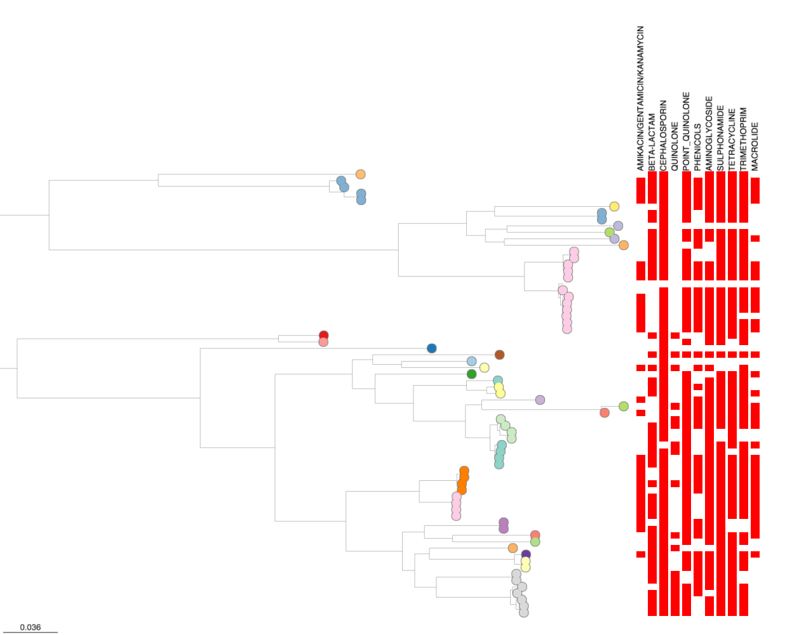
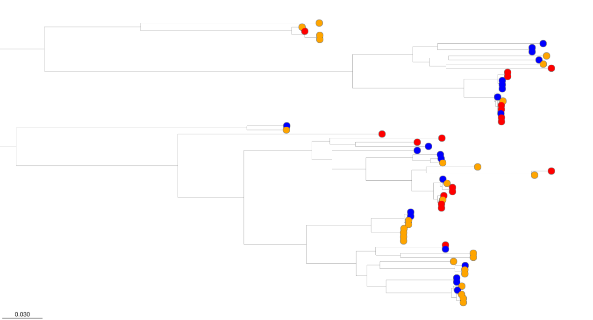
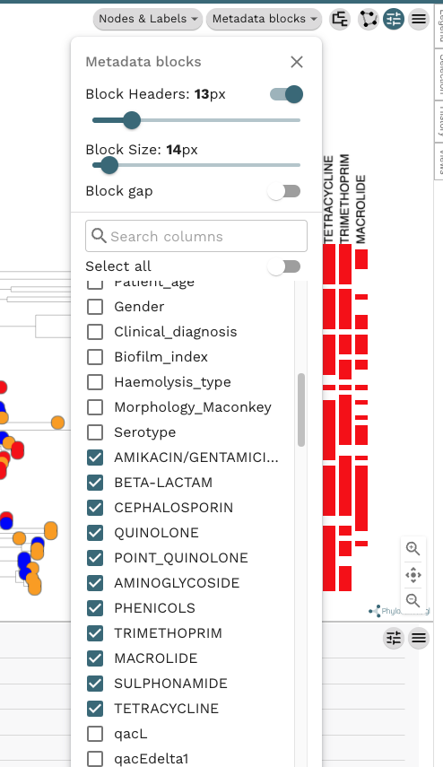
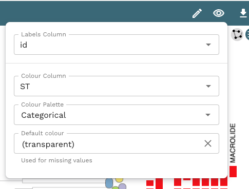

*Prepared by Nabil-Fareed Alikhan. Last updated 2024-03-28*

[Microreact](https://microreact.org/) can be used to compare a phylogeny with other contextual information. A useful feature of Microreact is to overlay information as 'Metadata blocks' alongside phylogenetic trees. This is the easiest way to do direct comparison with the evolutionary relationships (phylogeny) with other information. In this example we will look at at an existing published dataset and customise the information shown along side the tree. We are aiming to produce a figure like the one below, which shows the drug resistance (red) along side the genetic relationship for a group of sequenced isolates.

!!! tip 
    Please complete prequisite recipe about [uploading to Microreact](./basic-upload.md). 

## Microreact features demonstrated

* Overlaying additional genetic data (AMR prediction & genotyping) with evolutionary relationships 
* Basic customisation of visualised trees - changing tip colour.

## About this dataset 

This example shows data presented in Afolayan et al. (2022)[^1]. The study focuses on Escherichia coli bloodstream infections in Nigeria, highlighting their severity and the importance of managing them effectively. It notes the lack of comprehensive data in Nigeria regarding prevalent E. coli lineages, disease-causing attributes, and suitable drugs for treatment. The research conducted antimicrobial susceptibility testing on 68 bloodstream E. coli isolates from three Nigerian hospitals and utilized whole-genome sequencing (WGS) to analyze and characterize these strains.

* [Link to Microreact project](https://microreact.org/project/hmj3KwxS1dmmFPCKFx6qeA-invasive-escherichia-coli-sw-nigeria-2016-2018)
* [Link to metadata table](https://microreact.org/api/files/raw?24b84257a3f709b645d02901978ea98198900fe5)
* [Link to phylogenetic tree](https://microreact.org/api/files/raw?d73e379972dfb70ef31b371e1ef619d034d5d2dd)

## Tutorial
    
You be able should upload the metadata table and phylogenetic tree and have a new Microreact project. If you are unsure how to do that please complete prequisite recipe about [uploading to Microreact](./basic-upload.md). When you load in the data, the tree will appear in one panel with the tips colored by one of the data table column values. 

Press the icon on the top right of the tree panel. In the Metadata blocks dropdown list, tick all boxes for antimicrobials (in capital letters). In this same menu, you can also customise the block feature scaling with options like 'Block headers' and 'Block Size'. You can export the chart as a seperate image (svg or png) by using the hamburger menu button in the top right. As you click on the different values, a metadata block will appear with the label. In the metadata track, in this case, red means presence and white is absence.  If you need to refer to the legend click the Legend tab on the right, and scroll down.

Try changing the colour coding for the tree tips by clicking on the 'eye' icon at the top and selecting ST for Colour Column in the menu. 

With these simple steps, you should have a figure in the tree panel similar to the original figure we set out to create. You can export the chart as a seperate image (svg or png) by using the hamburger menu button in the top right. 

{width="60%"}

Congratulations! You have completed this recipe for Microreact. You can continue by browsing the various recipes listed on the right, and trying to recreate them yourself with the example data provided. These will hopefully provide inspiration for possible visualisations you can create with your own data. 

[^1]: Afolayan AO, Aboderin AO, Oaikhena AO, Odih EE, Ogunleye VO, Adeyemo AT, Adeyemo AT, Bejide OS, Underwood A, Argimón S, Abrudan M, Egwuenu A, Ihekweazu C, Aanensen DM, Okeke IN. An ST131 clade and a phylogroup A clade bearing an O101-like O-antigen cluster predominate among bloodstream Escherichia coli isolates from South-West Nigeria hospitals. Microb Genom. 2022 Dec;8(12):mgen000863. doi: [10.1099/mgen.0.000863](https://doi.org/10.1099/mgen.0.000863). PMID: 36748556; PMCID: PMC9837563.